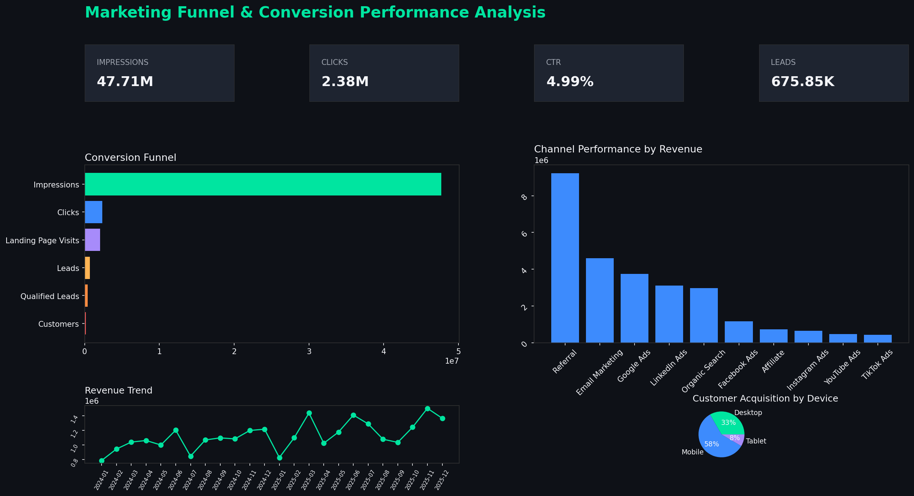

# 📊 Marketing Funnel & Conversion Performance Analysis


A production-style, end-to-end data analytics project that analyzes a marketing
funnel — from impressions to paying customers — to surface conversion rates,
drop-off points, channel and campaign performance, revenue/ROI trends, and
automatically generated business recommendations.

Built with **Python, Pandas, Streamlit, and Plotly**, with a companion **Jupyter
notebook** for deeper exploratory analysis and a **Power BI**-ready dataset.

---

## 🎯 Objectives

- Measure the full **funnel conversion rate**: Impressions → Clicks → Landing
  Page Visits → Leads → Qualified Leads → Customers
- Identify the stage with the **largest conversion drop-off**
- Compare **channel performance** (CTR, conversion, ROI) across 10 marketing
  channels
- Analyze **revenue performance** by channel, campaign, country, and device
- Track **lead-to-customer conversion** and cost efficiency (CPL, AOV, ROI)
- Generate **automated, data-driven business recommendations**

---

## 🗂 Dataset

`data/marketing_funnel.csv` — **2,400 synthetic but realistically-patterned
records** spanning Jan 2024 – Dec 2025, generated with channel-specific
conversion multipliers, seasonality (weekday/weekend, festive months), and
device/country/age skews so the funnel behaves like real marketing data
rather than random noise.

| Column | Description |
|---|---|
| `Date` | Campaign activity date |
| `Campaign` | Campaign name |
| `Marketing Channel` | e.g. Google Ads, Facebook Ads, Email, Referral, etc. |
| `Impressions` | Ad impressions served |
| `Clicks` | Ad clicks |
| `CTR` | Click-through rate (%) |
| `Landing Page Visits` | Visits to the landing page |
| `Leads` | Leads captured |
| `Qualified Leads` | Sales-qualified leads |
| `Customers` | Converted paying customers |
| `Conversion Rate` | Customers / Impressions (%) |
| `Revenue` | Revenue generated |
| `Cost` | Marketing spend |
| `ROI` | Return on investment (%) |
| `Country`, `Device`, `Age Group`, `Gender`, `Campaign Type` | Segmentation dimensions |

Regenerate the dataset any time with:
```bash
python generate_data.py   # located at the project root during generation
```

---

## 📁 Folder Structure

```
Marketing_Funnel_Analysis/
├── app.py                          # Main Streamlit dashboard
├── requirements.txt
├── README.md
├── LICENSE
├── .gitignore
├── assets/
│   ├── logo.png
│   ├── banner.png
│   └── style.css                   # Custom dark-mode dashboard styling
├── data/
│   └── marketing_funnel.csv
├── notebooks/
│   └── Marketing_Funnel_Analysis.ipynb
├── reports/
│   └── Marketing_Funnel_Report.pdf
├── screenshots/
│   └── dashboard.png
├── utils/
│   ├── data_loader.py              # Load, validate, clean, filter data
│   ├── metrics.py                  # KPIs, funnel/channel/campaign aggregation, insights
│   ├── charts.py                   # All Plotly chart builders
│   └── helpers.py                  # Formatting + CSV/Excel/PDF export
└── dashboard/
    ├── README.md                    # Power BI overview — start here
    └── PowerBI_Project/
        ├── PowerQuery_M.pq          # Power Query (M) data load & transform
        ├── DAX_Measures.dax         # 35+ DAX measures (KPIs, Funnel, ROI, Conversion, etc.)
        ├── Theme.json               # Real, importable Power BI theme
        ├── Visual_Layout_Specification.md
        └── Import_Instructions.md   # Step-by-step .pbix assembly guide
```

---

## ⚙️ Installation

```bash
# 1. Clone / unzip the project, then move into it
cd Marketing_Funnel_Analysis

# 2. (Recommended) create a virtual environment
python -m venv venv
source venv/bin/activate        # Windows: venv\Scripts\activate

# 3. Install dependencies
pip install -r requirements.txt
```

## ▶️ How to Run

```bash
streamlit run app.py
```

The dashboard opens at `http://localhost:8501`.

---

## 📈 Dashboard Features

- **Sidebar filters:** Date range, Marketing Channel, Campaign, Country, Device
- **10 KPI cards:** Impressions, Clicks, CTR, Leads, Qualified Leads,
  Customers, Revenue, Cost, ROI, Overall Conversion Rate
- **Interactive funnel chart** (Impressions → Customers) plus a stage
  drop-off bar chart
- **13 visualizations:** revenue trend, monthly trend, channel performance,
  campaign comparison, lead conversion by channel, customer acquisition by
  device, country-wise revenue, ROI by campaign, marketing cost analysis,
  customer distribution, channel×device heatmap, channel→campaign treemap
- **Automated insights**: best/worst channel, biggest drop-off, top ROI
  campaign, top country, most profitable device, revenue concentration
- **Automated recommendations**: 10 actionable, data-informed suggestions
- **Data export**: CSV, Excel, and a generated PDF summary report
- **Modern dark-themed UI** with gradient KPI cards and responsive layout

---

## 🧮 KPIs Tracked

Total Impressions · Total Clicks · CTR · Total Leads · Qualified Leads ·
Customers · Revenue · Marketing Cost · ROI · Overall Conversion Rate ·
Cost per Lead · Average Order Value

---

## 💡 Business Insights (examples the dashboard generates)

- Highest / lowest converting channel
- Largest funnel drop-off stage
- Highest ROI channel & campaign
- Best performing country by revenue
- Most profitable device
- Revenue concentration / channel dependency risk

## ✅ Recommendations (examples)

1. Improve landing page UX to reduce visitor-to-lead drop-off
2. Reallocate budget from low-ROI to high-ROI channels
3. Optimize ad creatives for channels with low CTR
4. Set up retargeting for funnel abandoners
5. Run structured A/B tests on landing pages and CTAs
6. Reduce cost-per-lead via organic/referral channel investment
7. Personalize offers by device and age group
8. Nurture qualified leads with automated email sequences
9. Introduce loyalty/referral incentives to raise CLV
10. Monitor monthly ROI trends to catch seasonal dips early

---

## 📓 Jupyter Notebook

`notebooks/Marketing_Funnel_Analysis.ipynb` walks through:
Data Cleaning → EDA → Feature Engineering → Conversion Analysis →
Drop-off Analysis → Channel Analysis → ROI Analysis → Revenue Analysis →
Final Business Insights. Fully executed with outputs included.

---

## 📊 Power BI Dashboard

`.pbix` is a binary format that only Power BI Desktop itself can write (the
data model uses Power BI's proprietary in-memory analytics engine — no
SDK exists to author it from a Python/text environment). Instead of a stub,
this project ships a **complete Power BI project package** in
`dashboard/PowerBI_Project/`:

| File | Contents |
|---|---|
| `PowerQuery_M.pq` | Full Power Query (M) scripts — fact table + date dimension, all transforms |
| `DAX_Measures.dax` | 35+ production DAX measures: KPIs, Funnel, Time Intelligence, Channel, Campaign, ROI, Conversion Rate |
| `Theme.json` | Real, directly-importable Power BI theme (dark mode, matches the Streamlit dashboard) |
| `Visual_Layout_Specification.md` | Exact pixel-level layout for 4 report pages, every visual's field wells |
| `Import_Instructions.md` | Step-by-step guide — ~20 minutes to assemble the final `.pbix` |

Everything needed is fully written out — no blank-canvas decisions left.
See `dashboard/README.md` to get started.

---

## 🚀 Future Scope

- Add predictive lead-scoring using Scikit-Learn (propensity to convert)
- Connect to a live ad-platform API (Google Ads / Meta) for real-time data
- Add cohort-based customer lifetime value (CLV) modeling
- Deploy the Streamlit app to Streamlit Community Cloud / Docker
- Add anomaly detection for sudden CTR/ROI drops

---

## 🖼 Screenshot



---

## 📄 License

Released under the [MIT License](LICENSE).
