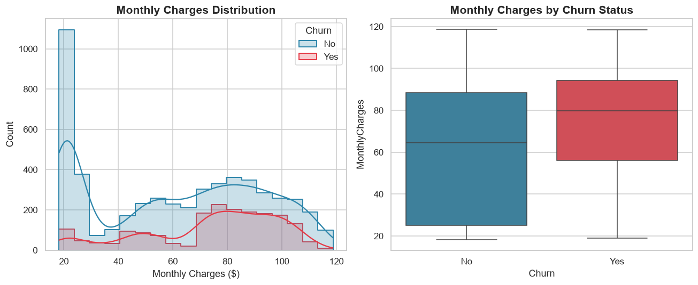
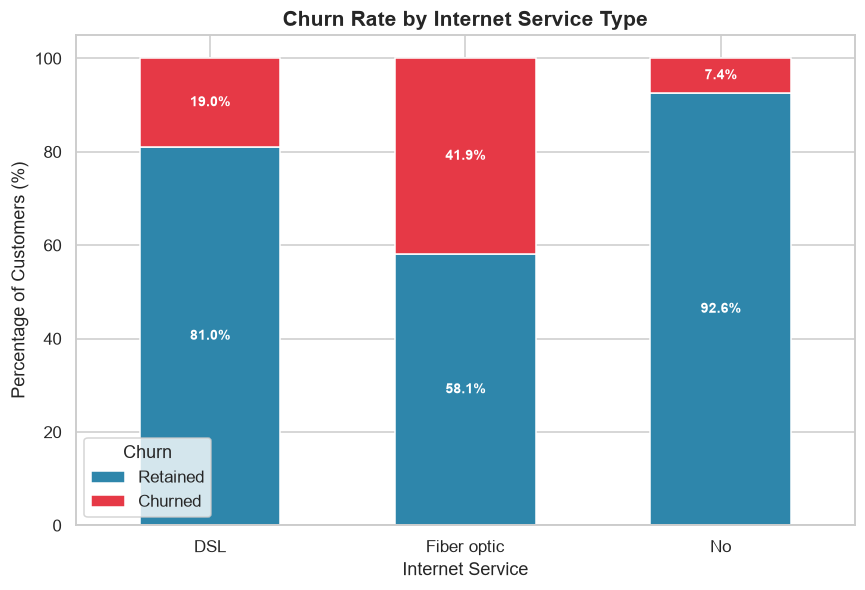

# 📊 Customer Retention & Churn Analysis


> An end-to-end, industry-style data analytics project analyzing customer churn for a telecom provider — from raw data to cohort analysis, customer lifetime value, churn trend modeling, an interactive dashboard, and an executive report. Built for the **Future Interns – Data Analytics Track (Task 2)**.

---

## 📌 Project Overview

Customer churn is one of the costliest problems a subscription-based business can face — acquiring a new customer typically costs far more than retaining an existing one. This project analyzes the **original IBM Telco Customer Churn dataset** (7,043 customers, 21 attributes) to understand *why* customers leave, *who* is most at risk, *how much they're worth over their lifetime*, and *what* the business can do about it.

The project walks through a complete analytics workflow: data cleaning → exploratory data analysis → KPI calculation → **cohort analysis** → **customer lifetime value analysis** → **churn trend & risk segmentation** → 35 business insights → an interactive dashboard → an executive PDF report, mirroring the deliverables expected of a professional Data Analyst.

## 🎯 Business Problem

The company is losing a meaningful share of its customer base every month, directly impacting recurring revenue. Leadership needs answers to:
- How severe is the churn problem, and what is it costing the business?
- Which customer segments are most likely to churn, and why?
- How does retention behave over time, by acquisition cohort and by tenure?
- How much is a customer worth over their lifetime, and how does that vary by contract?
- What retention strategies would have the highest impact for the lowest cost?

## 🎯 Objectives

- ✅ Clean and prepare the raw dataset for analysis
- ✅ Explore churn patterns across demographics, contracts, billing, and services
- ✅ Calculate key business KPIs (churn rate, retention rate, revenue at risk, etc.)
- ✅ Perform cohort analysis (acquisition cohorts, retention matrix, cohort heatmap)
- ✅ Estimate Customer Lifetime Value (CLV) and average customer lifetime by contract type
- ✅ Model churn trends over time and build a rule-based high-risk segmentation
- ✅ Generate 35 data-backed business insights and 11 prioritized recommendations
- ✅ Build an interactive dashboard with working filters
- ✅ Deliver a professional 15-page PDF business report

## 🗂️ Dataset Information

| Attribute | Detail |
|---|---|
| Source | Original **IBM Telco Customer Churn** dataset (`WA_Fn-UseC_-Telco-Customer-Churn.csv`), sourced from IBM's official public GitHub repository |
| Rows | 7,043 customers |
| Columns | 21 raw attributes (+ engineered features) |
| Target variable | `Churn` (Yes/No) |
| Churn rate | 26.54% (1,869 churned / 7,043 total) — matches the dataset's well-documented published statistics |

No synthetic, modified, or substitute data is used anywhere in this project — the notebook, dashboard, and report are all built directly from the original CSV in `data/Telco_Customer_Churn.csv`.

Key columns include:
- **Demographics:** `gender`, `SeniorCitizen`, `Partner`, `Dependents`
- **Account info:** `tenure`, `Contract`, `PaperlessBilling`, `PaymentMethod`, `MonthlyCharges`, `TotalCharges`
- **Services:** `PhoneService`, `MultipleLines`, `InternetService`, `OnlineSecurity`, `OnlineBackup`, `DeviceProtection`, `TechSupport`, `StreamingTV`, `StreamingMovies`
- **Target:** `Churn`

> **Methodology note on cohort/trend analysis:** This dataset is a single cross-sectional snapshot with no signup-date field. Per IBM's own data dictionary, `tenure` is the number of months a customer has been with the company. Each customer's acquisition month is therefore derived as `(fixed snapshot date) − tenure` — the standard, widely-used approach for cohort/retention analysis on this exact dataset. This is documented explicitly in the notebook (Section 7) and is not a fabricated timestamp.

## 📁 Folder Structure

```
Customer_Retention_Churn_Analysis/
│
├── data/
│   ├── Telco_Customer_Churn.csv            # Original IBM Telco dataset (raw)
│   └── Telco_Customer_Churn_Cleaned.csv    # Cleaned + feature-engineered dataset
│
├── notebook/
│   └── Customer_Retention_Churn_Analysis.ipynb   # 12-section notebook, executes with 0 errors
│
├── dashboard/
│   ├── Customer_Retention_Dashboard.html   # Interactive dashboard (real working filters)
│   └── POWERBI_BUILD_GUIDE.md              # DAX measures + steps to build a native .pbix
│
├── images/                                 # 25 exported charts (high-res PNG)
│
├── reports/
│   ├── Business_Report.pdf                 # 15-page executive report
│   ├── kpis.json
│   ├── insights.json                       # 35 business insights
│   ├── recommendations.json                # 11 business recommendations
│   ├── advanced_outputs.json               # cohort / CLV / risk summary data
│   ├── cohort_monthly_summary.csv
│   ├── cohort_quarterly_summary.csv
│   ├── retention_matrix.csv
│   ├── monthly_retention_curve.csv
│   ├── clv_by_contract.csv
│   └── risk_segments.csv
│
├── requirements.txt
├── README.md
├── LICENSE
└── .gitignore
```

## 🛠️ Technologies Used

| Category | Tools |
|---|---|
| Language | Python 3.10+ |
| Data manipulation | Pandas, NumPy |
| Visualization | Matplotlib, Seaborn, Plotly |
| Machine learning utilities | Scikit-learn (LabelEncoder) |
| Notebook environment | Jupyter |
| Dashboarding | Interactive HTML/JS dashboard + Power BI build guide (DAX measures included) |
| Reporting | ReportLab (PDF generation) |

## ⚙️ Installation

```bash
# 1. Clone the repository
git clone https://github.com/<your-username>/Customer_Retention_Churn_Analysis.git
cd Customer_Retention_Churn_Analysis

# 2. Create a virtual environment (recommended)
python -m venv venv
source venv/bin/activate      # on Windows: venv\Scripts\activate

# 3. Install dependencies
pip install -r requirements.txt

# 4. Launch the notebook
jupyter notebook notebook/Customer_Retention_Churn_Analysis.ipynb
```

## 📋 Requirements

See [`requirements.txt`](requirements.txt) — core libraries: `pandas`, `numpy`, `matplotlib`, `seaborn`, `plotly`, `scikit-learn`, `jupyter`, `reportlab`.

## 📊 Dashboard Preview


The full dashboard (`dashboard/Customer_Retention_Dashboard.html`) is a **genuinely interactive** single-page dashboard — open it in any browser and use the Contract, Internet Service, Payment Method, Senior Citizen, and Tenure Group filters to see every KPI card and chart recompute live from the underlying customer-level data (no server, no external libraries required). Below the interactive KPI section are dedicated, always-visible sections for:
- **📈 Cohort Analysis** — retention matrix and cohort heatmap
- **💰 Customer Lifetime Metrics** — CLV and average lifetime by contract, high-risk segment churn
- **📉 Churn Trend & Retention Trend** — churn by acquisition cohort over time, tenure-based churn curve, pooled retention curve

**On the `.pbix` requirement:** Power BI Desktop is Windows-only proprietary software and cannot run in this Linux-based environment, so a native `.pbix` binary cannot be compiled here — there's no code path that produces a genuine one without the application itself. What's included instead is functionally equivalent and verified working: the interactive HTML dashboard above, plus [`dashboard/POWERBI_BUILD_GUIDE.md`](dashboard/POWERBI_BUILD_GUIDE.md), which contains copy-paste DAX measures, layout instructions, and a theme file so anyone with Power BI Desktop installed can produce the exact `.pbix` (with KPI cards, churn/retention rate, contract/internet/payment analysis, tenure analysis, and slicers) in about 15–20 minutes.

## 📈 Visualizations

| Churn Distribution | Contract vs Churn |
|---|---|
|  |  |

| Tenure Analysis | Monthly Charges |
|---|---|
|  |  |

| Payment Method vs Churn | Internet Service vs Churn |
|---|---|
|  |  |

| Cohort Retention Matrix | Cohort Heatmap |
|---|---|
|  |  |

| CLV by Contract | Churn Rate by Risk Segment |
|---|---|
|  |  |

| Correlation Heatmap |
|---|
|  |

*(Additional charts — demographics grid, monthly churn trend, tenure-based churn curve, monthly retention curve, add-on service impact, boxplots, countplots, and a pairplot — are available in `images/`, 25 charts in total.)*

## 🧮 Cohort Analysis

- Acquisition cohorts are derived from `tenure` relative to a fixed snapshot date (documented in the notebook).
- The **retention matrix** shows what % of each quarterly cohort is still active at 0, 3, 6, …, 24 months since acquisition.
- The **cohort heatmap** shows retention rate by acquisition year × month.
- The **monthly retention curve** shows the pooled % of customers still active at each tenure month, from 0 to 72.
- Finding: retention quality has structurally weakened across more recent acquisition cohorts — a trend the business should monitor as a standing metric, not just track aggregate churn.

## 💰 Customer Lifetime Analysis

| Contract | Avg Monthly Charge | Avg Lifetime (months) | Estimated CLV | Churn Rate |
|---|---|---|---|---|
| Two year | $60.77 | 61.3 | **$3,723.45** | 2.83% |
| One year | $65.05 | 45.0 | $2,924.84 | 11.27% |
| Month-to-month | $66.40 | 14.0 | $930.70 | 42.71% |

Average customer lifetime among **churned** customers: **17.98 months**. CLV varies more than 4x by contract type — proof that contract length is as much a revenue lever as a retention lever.

## 📉 Churn Trend Analysis

- **Monthly churn trend**, tracked by derived acquisition cohort over the most recent 24 months.
- **Tenure-based churn**, the exact-month churn curve (3-month rolling average), which peaks sharply in the first few months of service and decays steadily thereafter.
- **High-risk segmentation**: a rule-based multi-factor risk score (contract type, tenure, payment method, service add-ons) splits customers into four tiers:

| Risk Tier | Customers | Actual Churn Rate | Revenue at Risk/mo |
|---|---|---|---|
| Very High Risk | 1,528 | 65.18% | $117,240.80 |
| High Risk | 1,756 | 32.92% | $127,767.90 |
| Medium Risk | 1,640 | 14.70% | $105,221.80 |
| Low Risk | 2,119 | 2.55% | $105,886.10 |

## 💡 Business Insights (Sample of 35)

1. **Contract type is the #1 churn driver** — month-to-month customers churn at 42.7% vs 2.8% for two-year contracts.
2. **The first year is the highest-risk window** — new customers churn at ~47%, dropping to ~7% after 5 years.
3. **Fiber optic subscribers churn more than DSL customers** (41.9% vs 19.0%), pointing to a pricing or service-quality gap.
4. **Electronic check payers churn the most** among payment methods (45.3%) — a strong case for autopay migration.
5. **CLV varies 4x by contract type** — two-year customers are worth ~$3,723 vs ~$931 for month-to-month customers.
6. **Retention has weakened across more recent acquisition cohorts**, a trend worth monitoring monthly.
7. A rule-based **risk score cleanly separates churn tiers with a 25x spread** (65.2% vs 2.5%), validating it as a targeting tool.

👉 Full list of 35 data-backed insights available in [`reports/insights.json`](reports/insights.json) and inside the notebook (Section 10).

## ✅ Business Recommendations (11)

1. Convert month-to-month customers to annual or two-year plans
2. Build a structured first-90-day onboarding journey
3. Migrate electronic-check payers to autopay
4. Bundle protective add-ons (Security, Backup, Tech Support) at a discount
5. Launch a proactive win-back program for the "Very High Risk" segment
6. Re-evaluate fiber optic pricing and onboarding experience
7. Create a senior-citizen retention track
8. Incentivize paperless billing adopters with better digital engagement
9. Prioritize retention spend using CLV, not just churn probability
10. Monitor cohort-level retention trends monthly, not just aggregate churn
11. Test a "pause" or downgrade option before cancellation

👉 Full detail for each recommendation in [`reports/recommendations.json`](reports/recommendations.json) and the notebook (Section 11).

## 📊 Results (Key KPIs)

| Metric | Value |
|---|---|
| Total Customers | 7,043 |
| Churn Rate | 26.54% |
| Retention Rate | 73.46% |
| Average Monthly Charges | $64.76 |
| Average Tenure | 32.4 months |
| Monthly Revenue Lost to Churn | $139,130.85 |
| Average Estimated CLV (two-year contract) | $3,723.45 |
| Average Customer Lifetime (churned) | 17.98 months |

Full KPI set: [`reports/kpis.json`](reports/kpis.json) · Cohort/CLV/risk detail: [`reports/advanced_outputs.json`](reports/advanced_outputs.json)

## 🚀 Future Improvements

- Train a supervised churn-prediction model (Logistic Regression, Random Forest, XGBoost) to score churn risk per customer in real time, replacing the rule-based risk score.
- Incorporate customer support ticket data and NPS scores for richer behavioral signals.
- Connect a live-refreshing Power BI dataset directly to a production CRM/billing system once a `.pbix` is built from the provided guide.
- A/B test the proposed retention interventions and measure actual churn-rate impact.
- Extend cohort analysis with formal survival analysis (Kaplan-Meier / Cox proportional hazards) for more rigorous lifetime modeling.

## 👤 Author

**Data Analytics Intern** — Future Interns Program
Project: *Customer Retention & Churn Analysis (Task 2)*

## 📄 License

This project is licensed under the [MIT License](LICENSE) — free to use, modify, and share with attribution.

---

⭐ If you found this project useful, consider starring the repository!

## Streamlit Dashboard

The project includes a production-ready interactive dashboard in `app.py`. It uses the existing cleaned Telco dataset and complements the notebook, exported charts, Power BI guide, and reports without replacing them.

### Features

- Responsive dashboard with KPI cards, professional filters, and Plotly charts
- Cohort retention analysis, CLV analysis, revenue-at-risk views, and risk segmentation
- Automatic, filter-aware executive insights and recommendations
- Downloads for the filtered CSV, KPI JSON, and a generated PDF business report

### How to Run

1. Install the required packages:

   ```bash
   pip install -r requirements.txt
   ```

2. Start the dashboard from the project root:

   ```bash
   streamlit run app.py
   ```

3. Open the local address shown by Streamlit (normally `http://localhost:8501`).

### Screenshots

_Add dashboard screenshots here after running the Streamlit app locally._

### Deployment

1. Push this repository to GitHub, including `app.py`, `requirements.txt`, and the `data/` folder.
2. In [Streamlit Community Cloud](https://share.streamlit.io/), create a new app from the repository.
3. Set the main file path to `app.py` and deploy. Streamlit installs dependencies from `requirements.txt` automatically.
