# Customer Retention & Churn Analysis Dashboard


An end-to-end telecom analytics portfolio project that turns the IBM Telco Customer Churn dataset into decision-ready retention intelligence. It combines a reproducible Jupyter notebook, an interactive Streamlit application, a browser dashboard, Power BI implementation guidance, exported visuals, and executive-ready reports.

## 📌 Project Overview

Customer churn erodes recurring revenue and increases acquisition costs. This project analyzes **7,043 telecom customers** to quantify churn, identify the customers and services most associated with attrition, and translate the evidence into retention actions.

The analysis covers customer churn and retention, tenure-derived cohort analysis, customer lifetime value (CLV), revenue at risk, and transparent risk segmentation. Business insights are delivered through a professional Streamlit dashboard and supporting report assets so stakeholders can filter the customer base, inspect drivers, and download results.

### Business Questions

- How large is the churn problem and how much recurring revenue is exposed?
- Which contract, payment, service, demographic, and tenure groups have the greatest retention risk?
- How does retention vary across estimated acquisition cohorts and customer lifetime stages?
- Which customers have the greatest estimated lifetime value, and where should retention investment be focused?

## ✨ Features

- ✅ Professional Streamlit dashboard with a responsive, modern UI
- ✅ Multi-select interactive filters for customer, contract, billing, and service attributes
- ✅ KPI cards for customer volume, churn, retention, charges, tenure, CLV, and revenue at risk
- ✅ Churn and retention analysis by contract, payment method, internet service, and tenure
- ✅ Tenure-derived cohort analysis, retention heatmap, matrix, and monthly retention table
- ✅ Customer segmentation with transparent high-, medium-, and low-risk rules
- ✅ Customer lifetime value analysis, including contract-wise CLV
- ✅ Revenue-at-risk and risk-segment revenue analysis
- ✅ Plotly interactive pie, bar, grouped bar, treemap, histogram, box, scatter, line, and heatmap charts
- ✅ Automatically refreshed business insights and actionable recommendations
- ✅ Filter-aware PDF business report, filtered CSV, and KPI JSON downloads
- ✅ Static executive PDF report and precomputed analytical outputs
- ✅ Power BI dashboard build guide with DAX measures

## 🛠️ Technologies Used

| Area | Tools |
|---|---|
| Data analysis | Python, Pandas, NumPy |
| Visualization | Plotly, Matplotlib, Seaborn |
| Dashboard | Streamlit, HTML dashboard |
| Analytics & modelling | Scikit-learn, rule-based risk segmentation |
| Business intelligence | Power BI (DAX build guide) |
| Research environment | Jupyter Notebook |
| Reporting | ReportLab, JSON, CSV, PDF |

## 🗂️ Project Structure

```text
Task_2_Customer_Retention_Churn_Analysis/
├── app.py                                      # Streamlit dashboard
├── requirements.txt                            # Python dependencies
├── README.md                                   # Project documentation
├── LICENSE                                     # MIT license
├── data/
│   ├── Telco_Customer_Churn.csv                # Raw IBM Telco data (7,043 × 21)
│   └── Telco_Customer_Churn_Cleaned.csv        # Cleaned, engineered data (7,043 × 27)
├── notebook/
│   └── Customer_Retention_Churn_Analysis.ipynb # 12-section analysis notebook
├── dashboard/
│   ├── Customer_Retention_Dashboard.html       # Standalone interactive browser dashboard
│   └── POWERBI_BUILD_GUIDE.md                  # DAX measures and Power BI build steps
├── images/                                     # 22 exported analysis and dashboard charts
│   ├── dashboard_preview.png
│   ├── churn_distribution.png
│   ├── cohort_heatmap.png
│   ├── clv_by_contract.png
│   └── ...
└── reports/
    ├── Business_Report.pdf                     # Executive business report
    ├── kpis.json                               # Core KPI values
    ├── insights.json                           # 35 data-backed insights
    ├── recommendations.json                    # 11 retention recommendations
    ├── advanced_outputs.json                   # CLV, cohort, and risk outputs
    ├── clv_by_contract.csv
    ├── cohort_monthly_summary.csv
    ├── cohort_quarterly_summary.csv
    ├── monthly_retention_curve.csv
    ├── retention_matrix.csv
    └── risk_segments.csv
```

## 🖥️ Dashboard Preview

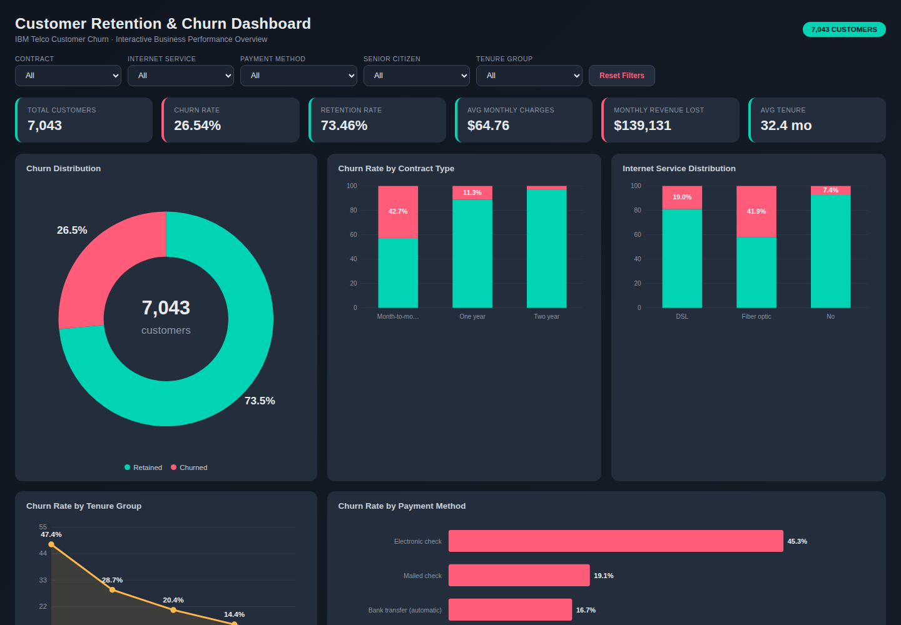

The Streamlit app in [`app.py`](app.py) recalculates every KPI and Plotly visual using the current filter selection. The standalone [`dashboard/Customer_Retention_Dashboard.html`](dashboard/Customer_Retention_Dashboard.html) provides an additional browser-based interactive experience, while [`dashboard/POWERBI_BUILD_GUIDE.md`](dashboard/POWERBI_BUILD_GUIDE.md) documents the DAX measures and layout needed to build a native Power BI report.

## 🌐 Live Demo

🚀 Streamlit App

https://madhu-customer-retention-dashboard.streamlit.app/

---


## 🏠 Dashboard Home
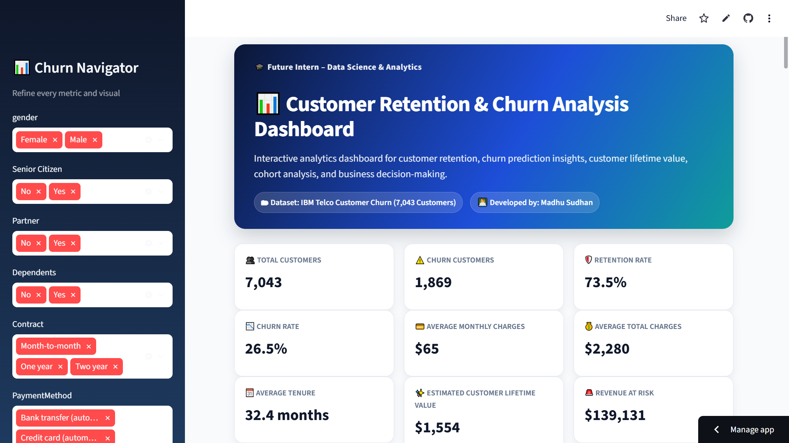

---

## 📊 KPI Dashboard
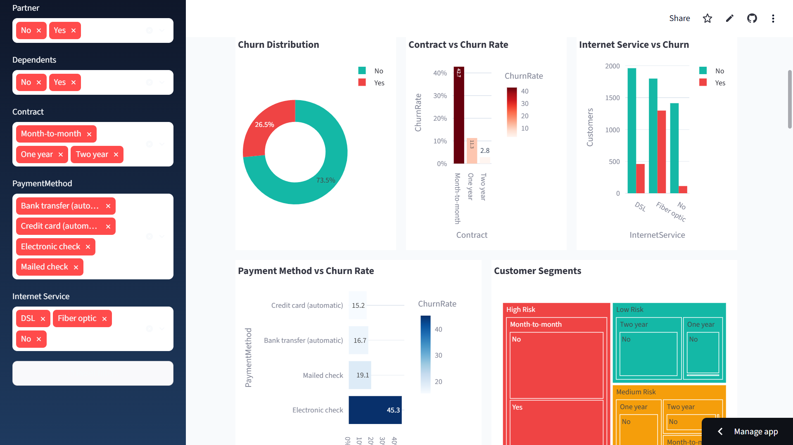

---

## 📈 Customer Churn Analysis
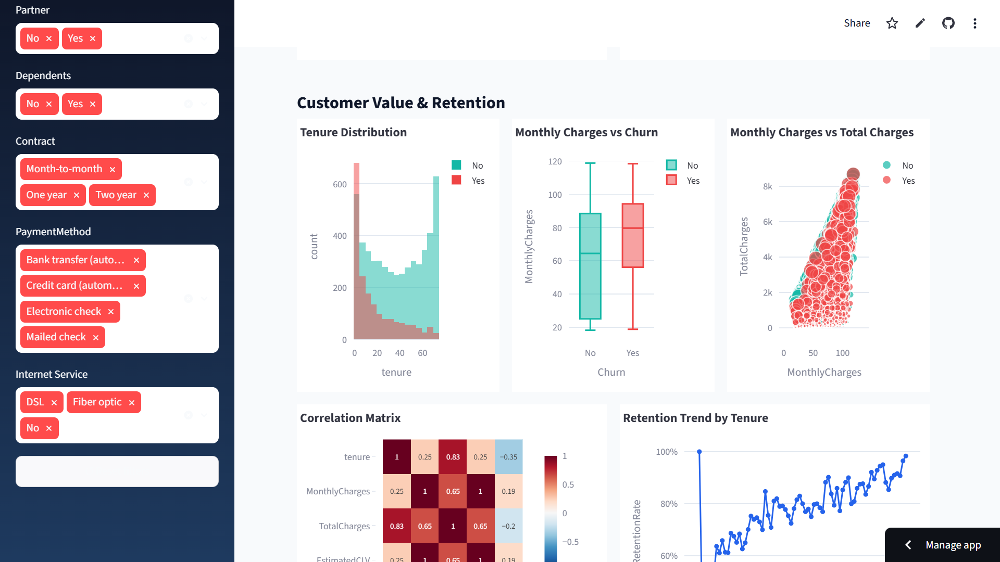

---

## 📉 Retention & Cohort Analysis
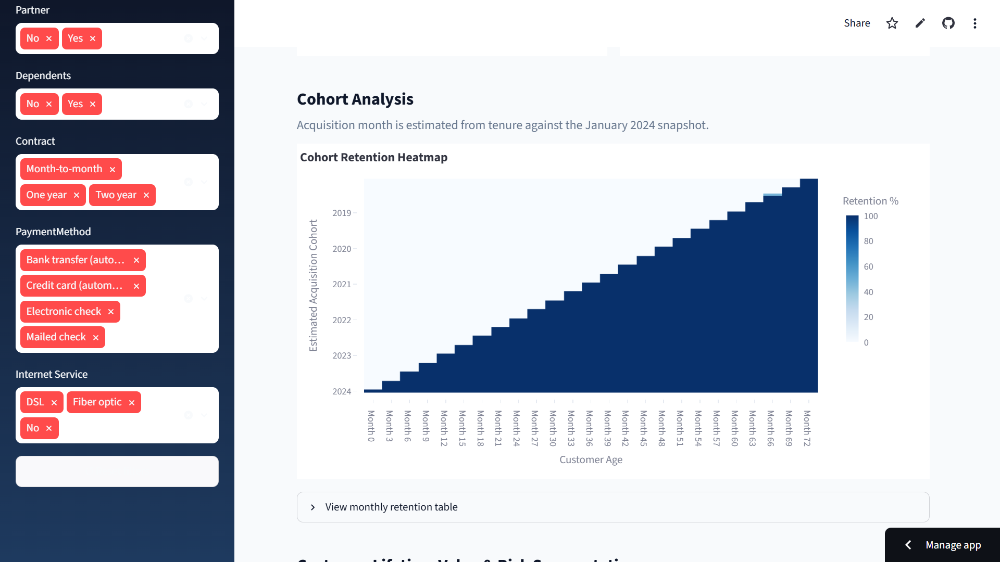

---

## 💡 Business Insights
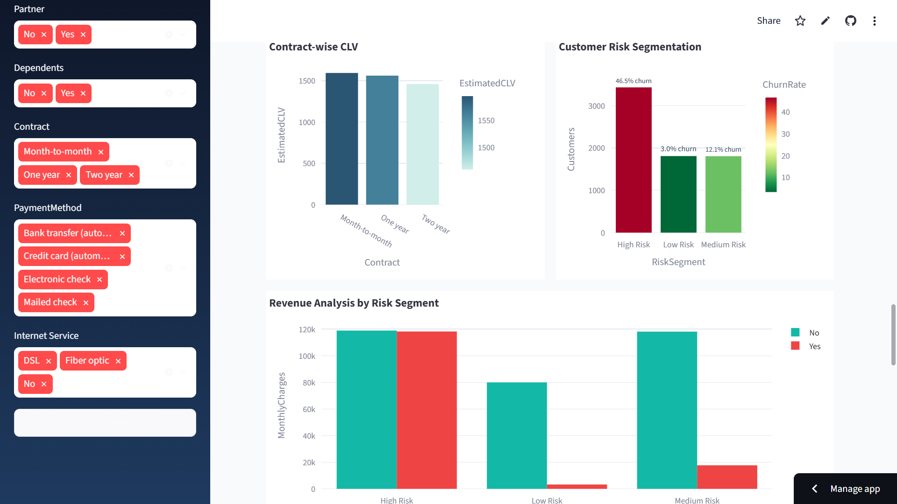

---

## 🎯 Recommendations Dashboard
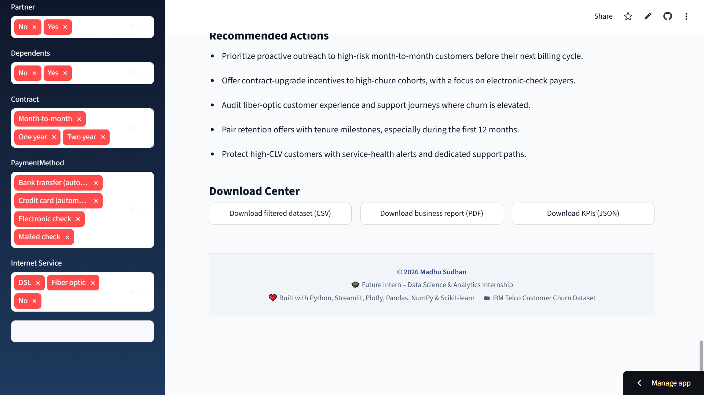

---

## 🔗 GitHub Repository

https://github.com/singhmadhusudan2003-wq/FUTURE_Data_Science_Analytics

## 📊 Key Performance Indicators

| KPI | Value |
|---|---:|
| Total customers | 7,043 |
| Churned customers | 1,869 |
| Retention rate | **73.46%** |
| Churn rate | **26.54%** |
| Average monthly charges | $64.76 |
| Average total charges | $2,279.73 |
| Average tenure | 32.37 months |
| Total monthly recurring revenue | $456,116.60 |
| Monthly revenue associated with churn | **$139,130.85** |
| Average estimated 24-month CLV | $1,554.28 |
| Average lifetime of churned customers | 17.98 months |

Source: [`reports/kpis.json`](reports/kpis.json) and [`reports/advanced_outputs.json`](reports/advanced_outputs.json).

## 🧭 Dashboard Features

| Section | What it delivers |
|---|---|
| Landing & sidebar | Clear executive framing plus filters for gender, senior citizen, partner, dependents, contract, payment method, and internet service |
| KPI cards | Total/churned customers, retention and churn rates, average charges, tenure, estimated CLV, and revenue at risk |
| Churn drivers | Distribution, contract, internet service, payment method, and customer-segment visuals |
| Value & retention | Tenure histogram, monthly-charge box plot, charges scatter plot, correlation heatmap, and tenure retention trend |
| Cohort analysis | Tenure-derived acquisition cohort heatmap and expandable monthly retention table |
| CLV & segmentation | Average/highest/lowest CLV metrics, contract-wise CLV, risk segmentation, and risk-segment revenue |
| Insight & action center | Sixteen dynamic insights plus focused retention actions based on active filters |
| Download center | Filtered customer CSV, dashboard KPI JSON, and a PDF business report |

> **Cohort methodology:** The IBM Telco data is a cross-sectional snapshot and does not include signup dates. The notebook and dashboard estimate acquisition month from tenure relative to a fixed January 2024 snapshot. This is clearly labelled as an estimate throughout the project.

## 💡 Business Insights

1. Month-to-month customers churn at **42.7%**, compared with **2.8%** for two-year contracts—the strongest observed churn driver.
2. Fiber-optic customers have **41.9%** churn versus **19.0%** for DSL customers.
3. Electronic-check customers churn at **45.3%**, the highest rate among payment methods.
4. Senior citizens churn at **41.7%**, compared with **23.6%** for non-seniors.
5. Customers without a partner churn at **33.0%** versus **19.7%** for customers with a partner.
6. Customers without dependents churn at **31.3%**, more than twice the **15.4%** rate for customers with dependents.
7. Customers in their first year churn at **47.4%**, while customers with five or more years of tenure churn at **6.6%**.
8. Paperless-billing customers churn at **33.6%**, versus **16.3%** for paper-billing customers.
9. Internet customers without Online Security churn at **41.8%**, versus **14.6%** for those with the service.
10. Customers without Tech Support churn at **41.6%**, compared with **15.2%** for those with support.
11. Churn falls from **21.4%** for customers with no add-on services to **5.3%** for customers with six add-ons.
12. Churned customers paid **$74.44/month** on average, **$13.18** more than retained customers; higher charges alone are not delivering loyalty.
13. Churned customers average **18.0 months** of tenure versus **37.6 months** for retained customers.
14. Churned customers represent **$139,130.85** in monthly billings, equivalent to **$1.67M** annualized.
15. Retention weakened from **96.5%** in the 2018 Q1 cohort to **43.2%** in the 2023 Q4 cohort.
16. Estimated CLV is more than four times higher for two-year customers (**$3,723.45**) than month-to-month customers (**$930.70**).
17. The precomputed Very High Risk tier churns at **65.2%**, versus **2.5%** for the Low Risk tier, validating the segmentation for targeted retention.

The complete evidence set is available in [`reports/insights.json`](reports/insights.json).

## 🎯 Business Recommendations

1. Convert high-risk month-to-month customers to one- or two-year contracts using value-led incentives.
2. Establish structured onboarding with 30-, 60-, and 90-day check-ins to protect new customers.
3. Encourage electronic-check customers to adopt autopay with a targeted enrollment benefit.
4. Audit fiber-optic pricing, reliability, and onboarding to understand its disproportionately high churn.
5. Bundle Online Security, Online Backup, and Tech Support for customers with few or no add-ons.
6. Equip retention teams with proactive contact lists for Very High Risk customers.
7. Create a senior-citizen retention journey with simplified billing and dedicated support.
8. Pair paperless billing with meaningful digital engagement instead of treating it as a passive preference.
9. Prioritize retention offers using both churn risk and estimated CLV to improve return on spend.
10. Review acquisition-cohort retention monthly to identify deterioration in acquisition or onboarding quality early.
11. Test pause, downgrade, or save offers at cancellation intent for price-sensitive customers.

Full recommendation detail is stored in [`reports/recommendations.json`](reports/recommendations.json).

## 🗃️ Dataset

The project uses the included **IBM Telco Customer Churn** dataset:

| Attribute | Detail |
|---|---|
| Raw file | [`data/Telco_Customer_Churn.csv`](data/Telco_Customer_Churn.csv) |
| Population | 7,043 telecom customers |
| Raw features | 21 columns |
| Target | `Churn` (`Yes` / `No`) |
| Cleaned file | [`data/Telco_Customer_Churn_Cleaned.csv`](data/Telco_Customer_Churn_Cleaned.csv) |
| Engineered output | 27 columns, including tenure/charge groups, add-on count, churn flag, and CLV estimate |

The dataset covers demographics, account tenure, contract type, billing, payment method, phone/internet services, add-on services, monthly and total charges, and churn outcome.

## 🚀 Installation

```bash
pip install -r requirements.txt
```

## ▶️ Run the Streamlit Dashboard

From the project root, run:

```bash
streamlit run app.py
```

Streamlit will provide a local URL, typically `http://localhost:8501`.

## 📓 Run the Notebook

```bash
jupyter notebook notebook/Customer_Retention_Churn_Analysis.ipynb
```

Open the notebook in Jupyter and use **Run All** to reproduce the cleaning, exploratory analysis, KPI calculation, cohort analysis, lifetime analysis, churn trends, insights, and recommendations.

## 🖼️ Visual Gallery

| Churn distribution | Contract analysis |
|---|---|
| 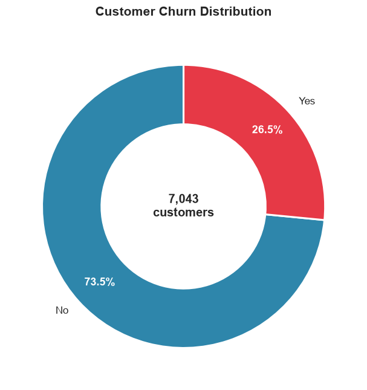 | 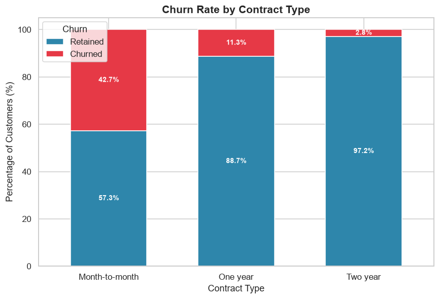 |
| Cohort retention | Customer lifetime value |
| 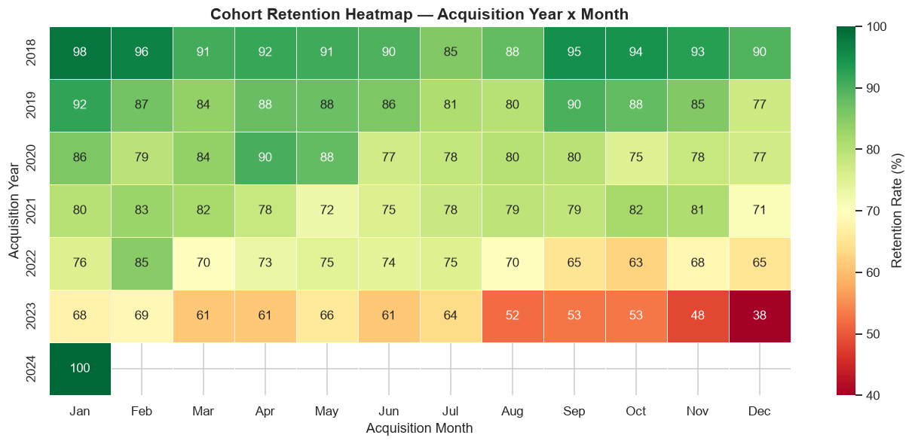 | 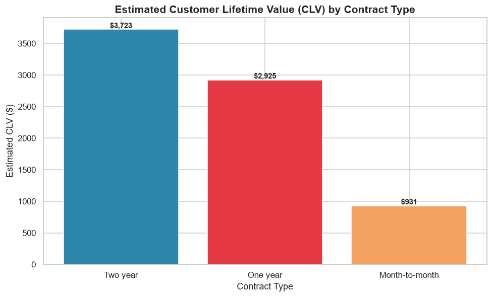 |
| Risk segments | Monthly churn trend |
| 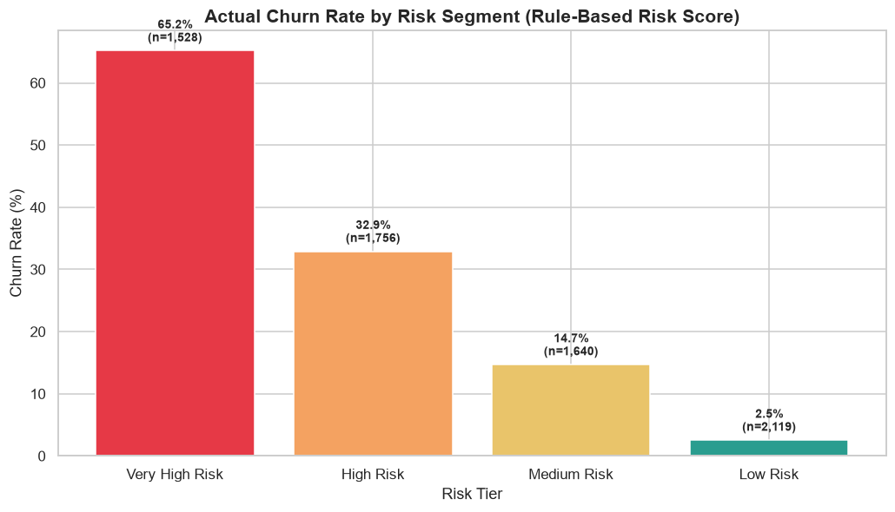 | 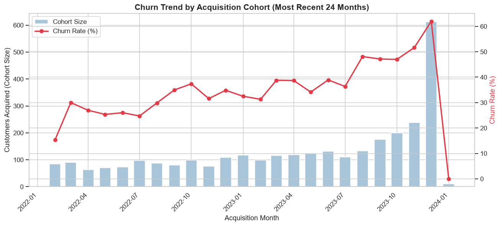 |
| Payment method | Correlation analysis |
| 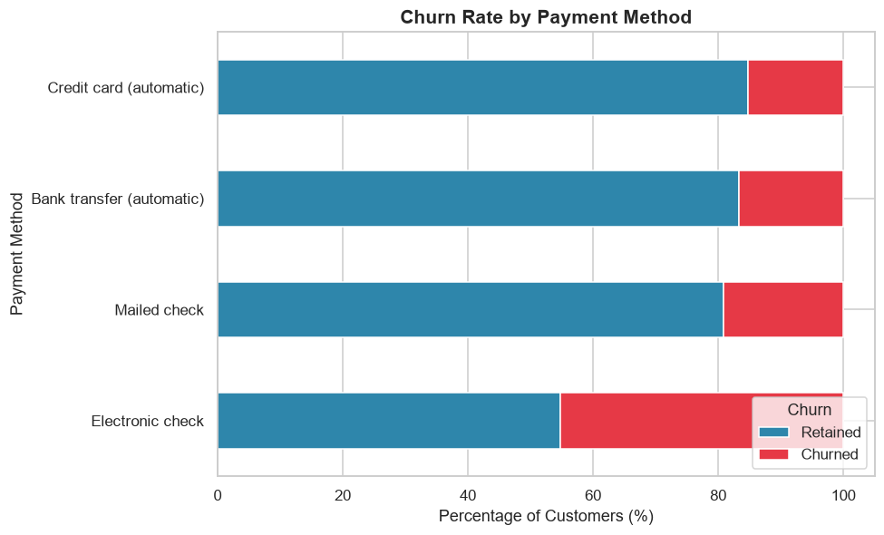 | 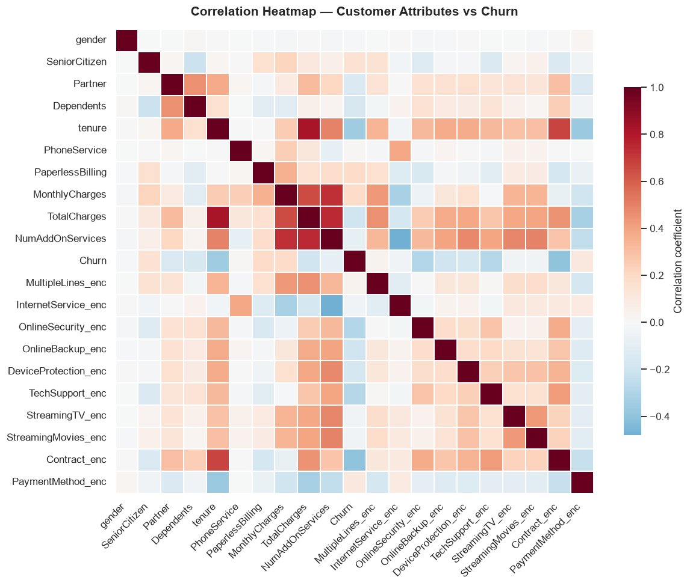 |
| Retention matrix | Tenure analysis |
| 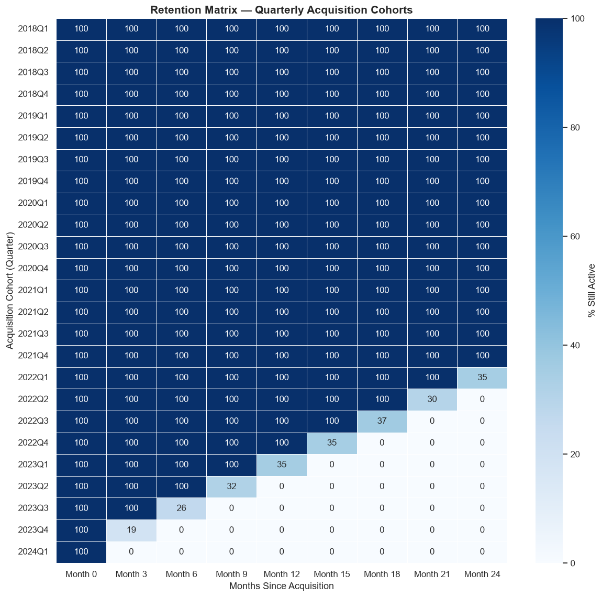 | 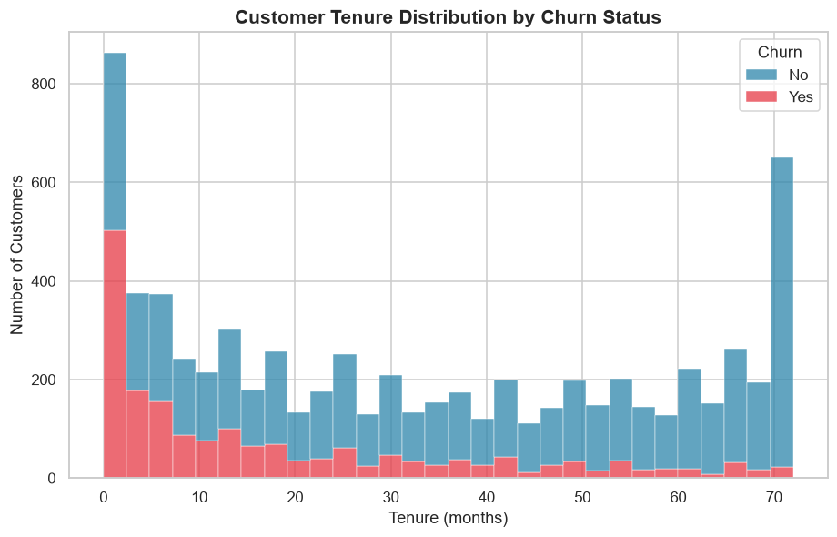 |

Additional exported visuals are available in [`images/`](images/), including demographic, internet-service, add-on-service, charge, and retention-curve analyses.

## 🔮 Future Improvements

- Train and validate supervised churn models such as Logistic Regression, Random Forest, and gradient boosting.
- Add model explainability, calibration monitoring, and customer-level risk scores.
- Integrate CRM, support-ticket, NPS, and product-usage data for richer behavioural signals.
- Connect a live CRM or billing source and schedule dashboard refreshes.
- Build a native `.pbix` report from the included DAX guide.
- Measure retention interventions with controlled A/B tests and incrementality analysis.
- Extend lifetime analysis with survival methods such as Kaplan–Meier and Cox proportional hazards.

## 📄 License

This project is licensed under the [MIT License](LICENSE).

## 👤 Author

**Madhu Sudhan**

Future Intern – Data Science & Analytics
